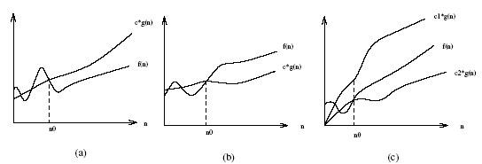

It's difficult to work directly with the time complexity functions as they tend to:
* have too many bumps (e.g. some problems size is nicely in favor)
* require too much detail to specify precisely

It's much easier to to talk in terms of simple upper and lower bounds of time-complexity functions by ignoring the difference between multiplicative constants (using the Big Oh notation).

## f(n) = O(g(n))
* means c * g(n) is an upper bound on f(n)
* thus there exists some constant c such that f(n) is always <= c * g(n)
* for large enough n (i.e., n >= n0 for some constant n0).

## f(n) = &Omega;(g(n))
* means c * g(n) is a lower bound on f(n)
* thus there exists some constant c such that f(n) is always <=  c * g(n)
* for all n >= n0.

## f(n) = &Theta;(g(n))
* means c1 * g(n) is an upper bound on f(n) and c2 * g(n) is a lower bound on f(n)
* for all n >= n0
* thus there exist constants c1 and c2 such that f(n) = c1 * g(n) and f(n) = c2 * g(n)
* this means that g(n) provides a nice, tight bound on f(n)

We are not concerned about small values of n (i.e., anything to the left of n0). The Big Oh notation enables us to ignore details and focus on the big picture.

## Working with Big Oh

* addition: the sum of two functions is governed by the dominant one

O(f(n)) + O(g(n)) => O(max(f(n), g(n)))

* constant multiplication: can be ignored (if c>0)

* multiplication: both operands are important:

O(f(n)) * O(g(n)) => O(f(n) * g(n))

## Reasoning about efficiency

A basic rule of thumb in Big Oh analysis is that worst-case running time follows from multiplying the largest number of times each nested loop can iterate.